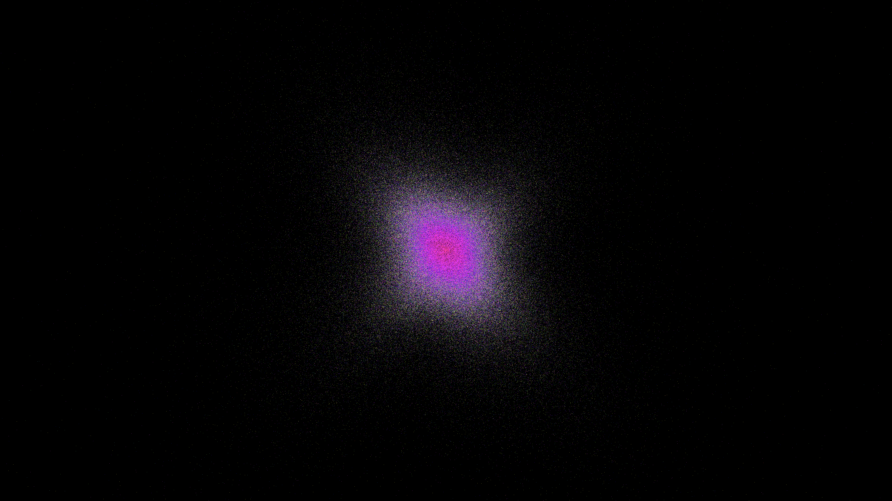

# CS 475 Project 7

This is my final project for [CS 475 Parallel Programming](https://web.engr.oregonstate.edu/~mjb/cs575/), taught by Dr. Mike Bailey at Oregon State University. Implemented in Rust with Vulkan, using the [`vulkano`](https://crates.io/crates/vulkano) bindings to the Vulkan API, and the [`cpal`](https://crates.io/crates/cpal) and [`minimp3`](https://crates.io/crates/minimp3) libraries for audio playback.

The project is an audio visualizer using a simple GPU-accelerated particle simulation. We render and simulate one million particles; with pressure interactions between particles in addition to gravity and drag. The constants of the simulation are determined by the amplitude and frequency spectrum of the background music. The effect of pressure on particles increases with audio amplitude, so when the song is louder the cloud expands outwards and vice versa. And each particle is influenced by a specific frequency range (indicated by its color): as the intensity of that frequency increases, the particle shines brighter, and the effect of drag is reduced causing the particle to move faster.

You can see a video of it in action [here (epilipsy warning)](https://media.oregonstate.edu/media/t/1_lje5d2si), but the video compression doesn't really do it justice. I recommend downloading and running it yourself: if you have Rust installed, all you need to do is `cargo run --release`.
